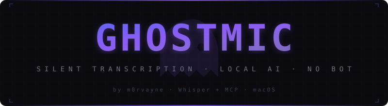

<div align="center">



**Your meetings, transcribed invisibly. No bot. No cloud. No one knows.**

Give Claude live context from your Zoom calls — everything runs locally on your Mac, nothing shows up in the participant list.

[](https://github.com/m0rvayne/ghostmic/actions)
[](https://github.com/m0rvayne/ghostmic)
[](https://python.org)
[](LICENSE)
[](https://modelcontextprotocol.io)

</div>

---

## The problem

Every meeting transcription tool puts a bot on your call:

```
Fathom:    👤 👤 👤 🤖 "Fathom Notetaker joined"
Otter:     👤 👤 👤 🤖 "Otter.ai joined"
Fireflies: 👤 👤 👤 🤖 "Fireflies.ai Notetaker joined"

ghostmic:  👤 👤 👤     (nothing. it's already recording.)
```

Your conversations go to their cloud. Everyone on the call sees the bot. People change how they talk.

**ghostmic** captures audio directly from the Zoom process via CoreAudio. No virtual drivers, no audio routing, no setup. Nobody knows. Nothing leaves your machine.

## How it works

- **Invisible.** No bot joins the call. CoreAudio Process Taps capture Zoom audio at the system level — no virtual drivers, no speaker changes.
- **Local transcription.** whisper.cpp (large-v3-turbo) with Metal GPU, model resident in memory via whisper-server. Canned-outro and sound-annotation filtering tuned on 1300+ real transcripts.
- **Live to Claude.** Transcript updates every ~15 seconds. Ask Claude anything mid-meeting.
- **Zero config.** No BlackHole, no Multi-Output Device, no Zoom speaker settings. Plug in any headphones, switch anytime — recording never breaks.
- **Auto-detection.** Background daemon detects Zoom calls. No buttons to press.
- **Speaker labels.** `[You]`, `[Remote]` and `[Both]`, from how far each channel sits above its own noise floor — so the labels survive a volume or mic-gain change mid-call. Mic auto-silences when you're muted in Zoom — private conversations stay private.
- **Menu bar app.** Ghost icon with pause/stop controls, live timer, settings.

## The AI pipeline

```
Zoom Audio
    |
    v
CoreAudio Process Tap (captures Zoom by bundle ID — no virtual driver)
    |
    v
Vocabulary biasing (participant names + your glossary as the initial prompt)
    |
    v
whisper.cpp large-v3-turbo (Metal GPU, model resident via whisper-server)
    |
    v
Rule-based cleanup (canned outros, sound annotations, repetition)
    |
    v
Transcript file ──> server.py (MCP) ──> Claude Desktop / Claude Code
```

### About the optional LLM pass

There is a Qwen3-0.6B post-processing stage behind `LLM_POST=1`. It is **off by
default**, because it was measured and it did not earn its place.

Over 40 real chunks (`tools/measure_llm_post.py`): 35% of the time the model
produced unrelated dialogue continued from the surrounding context instead of a
repair; 35% returned the text unchanged; most of the remaining edits silently
dropped the last sentence of the chunk, and one introduced a typo into a word
that had been correct. One edit in forty was a genuine fix.

Silent truncation is the reason it stays off. A garbled sentence is visibly
garbled and you can go listen again; a dropped one leaves nothing to notice.
If you enable it anyway, output that changes the text too much, loses a number,
or changes length too far is rejected and the transcribed text is kept.

## Install

```bash
curl -fsSL https://raw.githubusercontent.com/m0rvayne/ghostmic/main/install.sh | bash
```

One command. Sets up everything: Python venv, whisper.cpp model, Claude Desktop config, LaunchAgent, menu bar indicator. No audio drivers to install.

Then restart Claude Desktop (Cmd+Q → reopen). Done.

## Usage

Join a Zoom call. ghostmic detects it and starts recording. In Claude:

- *"What are they talking about?"*
- *"Summarize the last 10 minutes"*
- *"Make meeting notes"* — structured output with topics, decisions, action items
- *"Search meetings for 'budget'"*

## Configuration

Settings available in the menu bar indicator (ghost icon → ⚙ Settings):

| Setting | Default | Description |
|---------|---------|-------------|
| Whisper Model | `large-v3-turbo` | Lists the models present in `~/.ghostmic/models` |
| Speaker Labels | On | `[You]` / `[Remote]` / `[Both]` diarization |
| Language | `ru` | Forced language (set `auto` for auto-detect) |
| Save Path | `~/.ghostmic/transcripts` | Where transcripts are saved |

### Glossary

Names and domain terms go in `~/.ghostmic/config.json`:

```json
{ "glossary": ["Claude Code", "MCP", "майнд-карта", "Researcher"] }
```

These are fed to whisper as an initial prompt, which biases decoding toward the
spelling you want. It is the difference between

```
without:  «Мы обсудили Клод Кот и Майнд Карту в Ресерчере»
with:     «Мы обсудили Claude Code и Майнд-карту в Researcher»
```

Participant names detected from the Zoom window are appended automatically, and
go last because the end of the prompt carries the most weight. Only the last 224
tokens are used, so keep the list to terms whisper actually gets wrong. Edits
take effect on the next chunk — no restart.

## Why ghostmic vs competitors

| | Fathom / Otter / Fireflies | ghostmic |
|---|---|---|
| **Visibility** | Bot joins the call, everyone sees | Nothing. Invisible. |
| **Privacy** | Audio goes to their cloud | Never leaves your Mac |
| **Audio setup** | None (bot captures) | None (CoreAudio tap) |
| **Headphone switching** | N/A | No impact on recording |
| **Transcription** | Cloud ASR | whisper.cpp large-v3-turbo, on-device |
| **Claude integration** | None | Native MCP — live transcript in Claude |
| **Cost** | $15-30/month | Free, open source |

## Limitations

- **Zoom only.** Google Meet and Teams support planned.
- **macOS 14.4+.** Requires CoreAudio Process Taps API.
- **~15 second latency.** Audio chunks processed every ~10 seconds + AI pipeline.
- **Two-party speaker labels.** Cannot distinguish multiple remote speakers by voice.
- **No LLM cleanup by default.** The transcript is what Whisper heard, filtered for known artefacts — readable, but not polished prose.

<details>
<summary><strong>Troubleshooting</strong></summary>

**Screen Recording permission** — macOS will ask once to grant permission for audio capture. Go to System Settings → Privacy & Security → Screen Recording.

**Transcript is empty** — Check `tail -50 ~/.ghostmic/watcher.log` for errors.

**Microphone permission** — System Settings → Privacy & Security → Microphone → enable Terminal.

</details>

## Update / Uninstall

```bash
cd ghostmic && bash update.sh    # Update
bash uninstall.sh                # Clean removal
```

## Contributing

See [CONTRIBUTING.md](CONTRIBUTING.md).

## License

[MIT](LICENSE)
